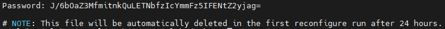
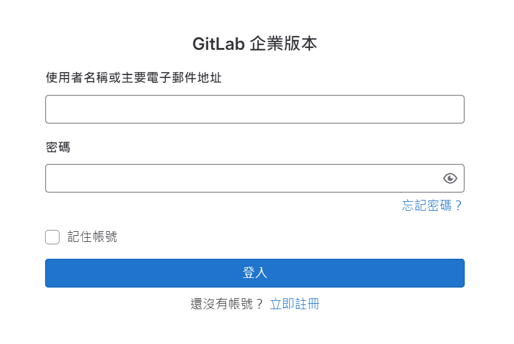
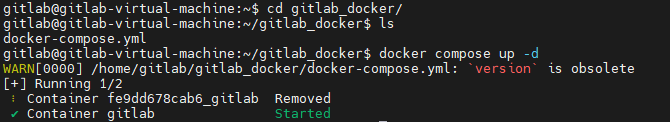
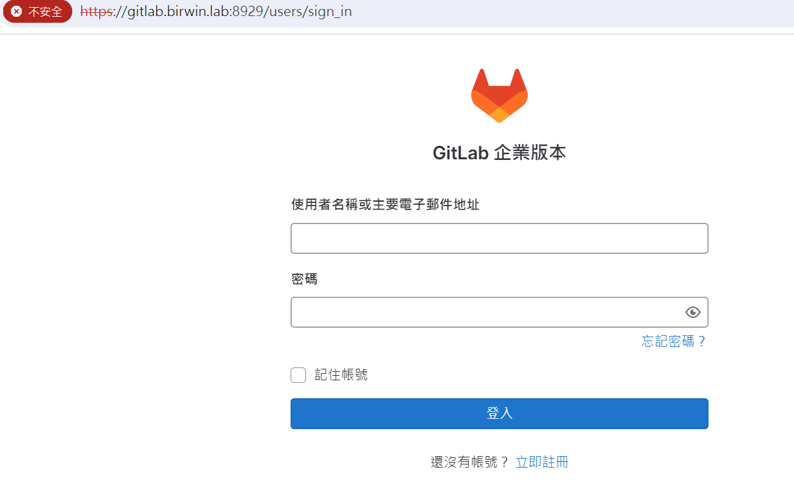
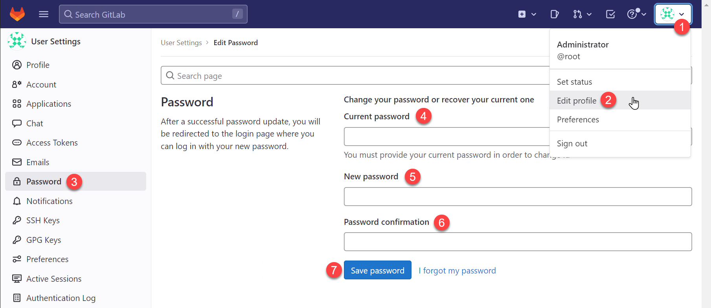

## 使用 apt 方式以 VM 安裝 Gitlab
1. Install and configure the necessary dependencies
```
sudo apt-get update
sudo apt-get install -y curl openssh-server ca-certificates tzdata perl
```
接下來，安裝 Postfix（或 Sendmail）來發送通知電子郵件。如果您想使用其他解決方案傳送電子郵件，請跳過此步驟並在安裝 GitLab 後設定外部 SMTP 伺服器。
```
sudo apt-get install -y postfix
```
在安裝過程中會遇到設定對話視窗。選擇`Internet Site`
使用你的外部DNS當作`mail name`然後點選Enter
如果還有其他選項出現，請持續點選確認並進行。


2. Add the GitLab package repository and install the package
```
curl https://packages.gitlab.com/install/repositories/gitlab/gitlab-ee/script.deb.sh | sudo bash
```
接下來，安裝 GitLab 套件。確保您已正確設定 DNS，並將 `https://gitlab.example.com` 變更為您要存取 GitLab 實例的 URL。安裝將自動在該 URL 上設定並啟動 GitLab。

如果您想為初始管理員使用者 (root) 指定自訂密碼，請查看[文件](https://docs.gitlab.com/omnibus/installation/index.html#set-up-the-initial-password)。如果未指定密碼，將自動產生隨機密碼。

```
sudo EXTERNAL_URL="https://gitlab.example.com" apt-get install gitlab-ee
```
這邊我則統一將 gitlab.example.com 修改成 `gitlab.birwin.lab`

3. Browse to the hostname and login

除非在安裝過程中提供了自訂密碼，否則密碼將隨機產生並在 `/etc/gitlab/initial_root_password` 中儲存 24 小時。使用此密碼和使用者名稱 root 登入。

```
sudo cat /etc/gitlab/initial_root_password
```




---

## 使用 docker compose 方式安裝 Gitlab

## Prerequisites
* [Install Docker](https://docs.docker.com/engine/install/ubuntu/)
* 必須使用有效的外部可存取主機名稱。不要使用`localhost`。

1. Set up the volumes location
在設定其他所有內容之前，請建立一個用於存放配置、日誌和資料檔案的目錄。它可以位於使用者的主目錄下（例如 ~/gitlab-docker），也可以位於 /srv/gitlab 等目錄中。若要建立該目錄：
```
sudo mkdir -p /srv/gitlab
```

配置新的環境變數 `$GITLAB_HOME` 以設定您建立的目錄的路徑：
```
export GITLAB_HOME=/srv/gitlab
```

您也可以將 `GITLAB_HOME` 環境變數附加到 shell 的設定檔中，以便將其應用於未來的所有終端會話：
* Bash: `~/.bash_profile`
* ZSH: `~/.zshrc`

2. Find the GitLab version and edition to use
在生產環境中，您應該將部署固定的 GitLab 版本。在 Docker 標籤頁面中找到要使用的版本：
* [GitLab Enterprise Edition tags](https://hub.docker.com/r/gitlab/gitlab-ee/tags/)
* [GitLab Community Edition tags](https://hub.docker.com/r/gitlab/gitlab-ce/tags/)

The tag name consists of the following:
```
gitlab/gitlab-ee:<version>-ee.0
```

3. Installation
### Install GitLab using Docker Compose
1. [Install Docker Compose](https://docs.docker.com/compose/install/linux/#install-using-the-repository)
2. Create a docker-compose.yml file:
```
version: '3.6'
services:
  gitlab:
    image: gitlab/gitlab-ee:16.9.0-ee.0
    container_name: gitlab
    restart: always
    hostname: 'gitlab.birwin.lab'
    environment:
      GITLAB_OMNIBUS_CONFIG: |
        # Add any other gitlab.rb configuration here, each on its own line
        external_url 'https://gitlab.birwin.lab:8929'
        gitlab_rails['gitlab_shell_ssh_port'] = 8024
    ports:
      - '8929:8929'
      - '8443:443'
      - '8024:2424'
    volumes:
      - '$GITLAB_HOME/config:/etc/gitlab'
      - '$GITLAB_HOME/logs:/var/log/gitlab'
      - '$GITLAB_HOME/data:/var/opt/gitlab'
    shm_size: '256m'
```
`因為要與本地端的gitlab分開，針對曝露的Port設定進行分開`

4. Make sure you are in the same directory as docker-compose.yml and start GitLab:
   ```
   docker compose up -d
   ```
   

   `https://gitlab.birwin.lab:8929`
   
   ```
   sudo cat /etc/gitlab/initial_root_password //找尋初始的密碼
   ```

5. 從 Web 介面初始化設定 GitLab

   更新`root`帳號密碼
   
   現在的介面已不相同，設定的東西是一樣的。

###  Push gitlab 相關設定
   * [Edit Profile] > 更新 SSH Keys 設定

     通常個人的 SSH 公開金鑰都放在 ~/.ssh/id_rsa.pub 路徑中，以下命令在 Bash 與 Windows PowerShell 都適用： 
     ```
     cat ~/.ssh/id_rsa.pub
     ```
     如果沒有建立過金鑰的話，可以透過 `ssh-keygen` 快速建立金鑰：
     ```
     ssh-keygen -t rsa -b 4096 -f $HOME/.ssh/id_rsa -P ""
     ```
   * 設定 git 忽略 SSL 憑證檢查
     可以設定 `GIT_SSL_NO_VERIFY` 這個環境變數，這樣就可以讓 `git` 忽略憑證的驗證：
     ```
     # 讓 Git Client 忽略 SSL 憑證檢查
     export GIT_SSL_NO_VERIFY=1
     ```
     若要讓 `git` 永久忽略 SSL 憑證檢查，可以直接將設定寫入 `git` 的設定檔：
     ```
     # 設定讓 Git Client 永久忽略 SSL 憑證檢查
     git config --global http.sslverify false
     ```

----
## Git switch remote URLs. Git 更換遠端伺服器倉庫網址
Git 更換遠端伺服器倉庫網址URL
1. 確認目前Git遠端伺服器網址： `git remote -v`
2. 更換Git遠端伺服器位網址，使用：`git remote set-url`
3. 再次確認Git遠端伺服器網址
4. 如果是使用SSH的存取網址，指令一樣是使用git remote set-url，再接上新的SSH URL就可以更換，指令如下：
```
git remote set-url origin git@github.com:USERNAME/OTHERREPOSITORY.git
```
不管是要HTTP/HTTPS跟SSH，二種存取網址都是可以直接做更換，然後下次git push/ git fetch 就會到新設定的網址去了唷。

參考來源：
* https://blog.miniasp.com/post/2023/04/24/Install-and-Configure-GitLab-on-Ubuntu-2204-LTS
* https://docs.gitlab.com/ee/install/docker.html#install-gitlab-using-docker-compose
* https://officeguide.cc/git-https-server-certificate-verification-failed-solution/
* https://gitbook.tw/chapters/github/fail-to-push